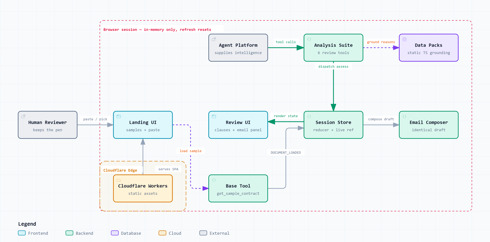

# Redline

Redline is a WebMCP contract-review studio. Paste an employment contract and your AI agent — working through the app's registered WebMCP tools — extracts every clause, flags the risky ones, and proposes inline redlines you accept or reject one by one ("Keep as-is" / "Redline it"). Accepted redlines roll up into a negotiation email. The document starts blurred and snaps into clarity as you decide: clarity is the progress bar.

**Normal people get what lawyers have.** The agent reads the fine print; the app gives it eyes and hands inside the document — and the human keeps the pen.

**Live:** https://redline.kangyow.workers.dev/

## Demo

<video src="video-src/redline-final-1080p.mp4" controls width="100%" poster="image/redline-SS1.png">
  Your browser does not support the video tag.
  Watch it here: <a href="video-src/redline-final-1080p.mp4">redline-final-1080p.mp4</a>
</video>

## Use it

1. **Load a contract** — pick a sample (overbroad offer letter, training repayment agreement, one-way NDA) or paste your own.
2. **Open your AI assistant** — ChatGPT Desktop, or a WebMCP-capable browser agent (Chrome with WebMCP enabled) — and ask it to review.
3. **Decide each redline** — your negotiation email writes itself as you go.

## The WebMCP tool surface

Seven tools, all registered client-side via `document.modelContext.registerTool`, phase-gated: the base tool registers at boot, the analysis suite registers on document load, and everything unregisters on reset.

| Tool | Purpose |
| --- | --- |
| `get_sample_contract` | Load a built-in sample into the review session |
| `get_document_state` | Live snapshot: title, source, phase, progress counts |
| `extract_clauses` | All clauses in document order, with the seven restrictive-covenant families |
| `get_clause_text` | Verbatim clause text for re-grounding before drafting redlines |
| `assess_clause` | Record per-clause summary, flags, proposed redlines, note to the human |
| `get_enforceability_context` | Grounded context: US state profiles for non-competes, key-state TRAP statutes, five-family reasonableness rubric |
| `export_negotiation_email` | The negotiation email, composed from the user's current decisions — byte-identical to the page |

## Architecture



- No backend, no database, no API keys — the agent platform supplies 100% of the intelligence; Redline supplies structure, state, and UI.
- All tools read the store through a live ref, so there are no stale closures; data flows tools → actions → store → UI, single direction.
- Clarity is derived, never stored.
- Tool descriptions are the only prompt surface — no system-prompt access.
- The session lives in memory; refresh is a clean start.
- Static TypeScript data packs (non-compete state profiles, TRAP statutes, reasonableness heuristics) give the agent grounding.

## Stack

React 19 + Vite + TypeScript; vanilla CSS custom properties; self-hosted fonts (Newsreader, Inter via Fontsource); `webmcp-types`; Cloudflare Workers static assets via Wrangler.

## Run and deploy

```sh
npm install
npm run dev
```

```sh
npm run build
npm run deploy
```

Deploy goes through Wrangler to Cloudflare Workers static assets.

## Enabling WebMCP

- **ChatGPT Desktop** — WebMCP works natively, no flags needed.
- **Chrome** — enable `chrome://flags/#enable-webmcp-testing`. WebMCP requires a secure context.

## Privacy and disclaimer

The document lives in the browser session; only what the tools return reaches the agent platform. Redline is a demo, not legal advice.

## License

MIT — see [LICENSE](LICENSE).
